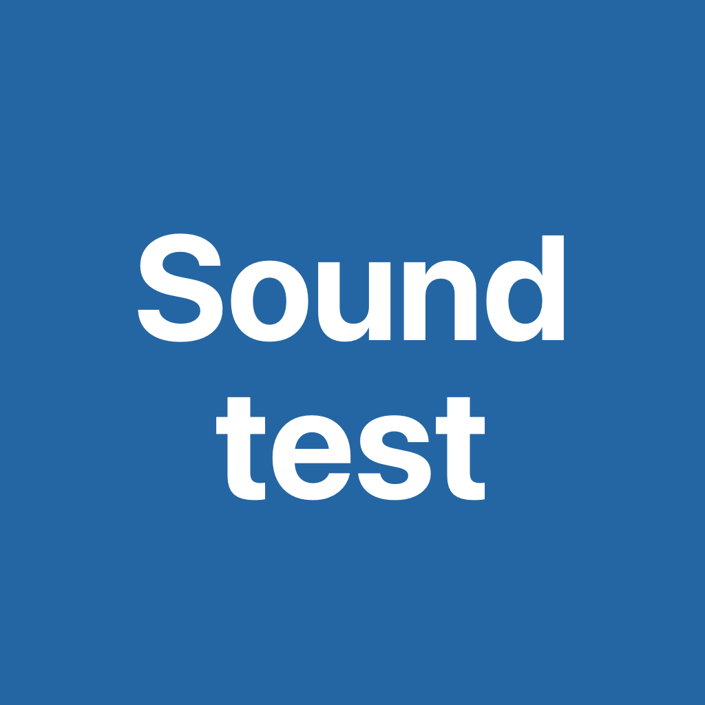

<div align="center">



# SoundTest

**面向 iOS 的本地环境声音事件分析与模型对照工具**

[](https://github.com/Roylyl/SoundTest/releases)
[](https://github.com/Roylyl/SoundTest/releases)
[](https://github.com/Roylyl/SoundTest/stargazers)
[](https://github.com/Roylyl/SoundTest/forks)
[](https://github.com/Roylyl/SoundTest/issues)
[](LICENSE)
[](https://github.com/Roylyl/SoundTest)
[](https://github.com/Roylyl/SoundTest/commits/main)
[](#打开与运行)

[项目概览](#项目概览) · [核心能力](#核心能力) · [模型](#首批模型) · [快速开始](#打开与运行) · [架构](#仓库结构) · [使用](#使用步骤与默认设置) · [测试方案](#测试项目参考) · [验证](#验证与后续) · [隐私](#隐私与本地数据) · [许可](#许可与版权边界)

</div>

## 项目概览

SoundTest 1.0.0 是完全本地运行的 iOS 环境声音事件测试工具，复用 ASRtest 的录音会话管理、输入源选择、资源校验、本地日志和原生界面处理。原 [ASRtest](https://github.com/Roylyl/ASRtest) 保持独立，SoundTest 不包含旧 ASR 权重。

应用将四组本地音频分类模型放在统一的测试、日志与设置流程中，面向模型接入验证、同条件对照和可复查记录。模型推理、资源校验和会话日志都在设备本地完成；安装后的冷启动和模型切换不需要下载或导入模型。

> [!NOTE]
> 仓库中的应用版本号为 **1.0.0**。顶部 Release 与 Downloads 徽章读取 GitHub 的实时公开数据；版本号本身不代表已经创建对应的 GitHub Release。

## 核心能力

- **四模型本地推理**：Zipformer-small、CED-Tiny、CED-Mini 通过 sherpa-onnx 运行，YAMNet 通过本地 TensorFlow Lite C 运行。
- **统一输入与分析流程**：支持麦克风单段识别、连续分窗和系统可解码音频文件导入。
- **可复查输出**：保留 Top-5、完整类别分数、重点类别、窗口列表、事件时间线、配置和异常信息。
- **明确事件口径**：分别记录分析窗口覆盖范围与估计事件范围，不把模型分数解释为准确率或校准概率。
- **离线资源管理**：模型与运行库随工程准备，通过固定来源清单、字节数和 SHA256 校验身份。
- **测试边界透明**：模拟器、固定音频和程序链路验证不会被表述为物理 iPhone 上的准确率、能耗、温升或长期稳定性结论。

## 许可与版权边界

本仓库中由 SoundTest 项目自行编写、且未另行标注来源的源码与文档，按根目录 `LICENSE` 中的 Apache License 2.0 提供。Apache-2.0 不会覆盖仓库中的第三方运行库、模型权重、类别表和测试音频；这些文件仍分别受其原始许可和使用条件约束。完整清单、固定版本、哈希、上游链接与本地修改见 `THIRD_PARTY_NOTICES.md`。

需要特别注意：

- `Packages/` 包含 sherpa-onnx、ONNX Runtime 和 TensorFlow Lite C 的预编译二进制及对应许可文件。
- `ModelLibrary/` 包含四组第三方模型与类别表。Zipformer-small 和 YAMNet 有随文件保留的 Apache-2.0 依据；CED-Tiny、CED-Mini 的原始权重卡声明 Apache-2.0，但 k2-fsa 转换仓库没有单列新的许可字段，使用和再分发前仍应结合上游模型卡自行确认。
- `Tests/Unit/Fixtures/` 的四段 ESC-50 音频只供自动化功能检查，不进入生产 App。其中完整数据集适用 CC BY-NC 3.0，部分原始录音另有 CC0、CC-BY 或 CC-BY-NC 条款；不得把这些音频当作 Apache-2.0 代码或默认商用素材。
- Apple SDK 与系统框架由各自条款管理。商标、数据集名称和第三方项目名称归各自权利人所有。

仓库保留许可与署名文件，是为了如实记录当前打包内容，不构成对任何具体商业用途的法律保证。公开发布、商用、换用模型或新增音频前，应重新核对相应上游版本和条款。若只需要自行编译 App，也不要删除 `LICENSE`、`THIRD_PARTY_NOTICES.md`、`Docs/SherpaLicenses/`、`ModelLibrary/*/README.md` / `LICENSE`、`Packages/*/LICENSE` 或 `Tests/Unit/Fixtures/` 中的许可与署名文件。

## 打开与运行

### 环境要求

| 项目 | 当前工程要求或验证环境 |
|---|---|
| 部署目标 | iOS 17.0 或更高版本 |
| 语言 | Swift 5 |
| 当前构建环境 | Xcode 27.1 |
| 本地运行库架构 | arm64 iPhone、Apple Silicon iOS Simulator |
| 大文件获取 | Git LFS |

仓库使用 Git LFS 保存 `.onnx`、`.tflite`、`.xcframework` 内二进制和测试 `.wav`。若只取得 LFS 指针文件，Xcode 将无法加载模型或链接本地运行库。

### 快速开始

```sh
git lfs install
git clone https://github.com/Roylyl/SoundTest.git
cd SoundTest
git lfs pull
open SoundTest.xcodeproj
```

在 Xcode 中选择共享 Scheme `SoundTest` 和自己的 iPhone 或受支持的 arm64 iOS Simulator 后运行。支持的系统使用原生 Liquid Glass 控件，较低版本使用系统控件。

签名沿用本机开发团队，Bundle Identifier 独立为 `com.roylyl.soundtest.ios.a941f206`。其他开发者需要在 **Signing & Capabilities** 中设置自己的团队和唯一标识。App 版本为 `1.0.0`，图标沿用蓝底白字两行文字：Sound / test。

模型和运行库已在本地工程准备好，Swift Package 仅引用 `Packages/SherpaTagging` 和 `Packages/YAMNetRuntime` 两个本地包。安装后可关闭网络冷启动和切换四组模型，不需要下载或导入模型。

## 仓库结构

```text
SoundTest/                 SwiftUI 界面、音频采集、事件分析、模型存储与推理封装
SoundTest.xcodeproj/       App、单元测试与 UI 测试工程及共享 Scheme
Config/                    Info.plist 等工程配置
ModelLibrary/              四组模型权重与类别表（Git LFS）
Packages/                  SherpaTagging 与 YAMNetRuntime 本地 Swift Package
Scripts/                   来源清单校验与 App 清单生成脚本
Tests/                     单元、集成与 UI 测试源码及固定测试素材
Docs/                      集成、验证、评测方案、许可证据与研究记录
ModelsManifest.json        模型来源、固定 revision、大小与 SHA256
THIRD_PARTY_NOTICES.md     第三方组件、模型、类别表和测试音频的许可边界
```

## 首批模型

下表大小是实际必要权重加各自类别表，按十进制 MB；不等于安装大小和运行内存。四组共 **47,800,263 字节（47.80 MB）**。

|编号|模型|实际运行库|权重与标签大小|输出与默认窗口|
|---|---|---|---:|---|
|M01|Zipformer-small Audio Tagging INT8，2024-04-15|sherpa-onnx 1.13.8 / ONNX Runtime 1.28.2|27.05 MB|527类；10秒 / 步长2秒|
|M02|CED-Tiny INT8，2024-04-19|同上|6.15 MB|527类；10秒 / 步长2秒|
|M03|CED-Mini INT8，2024-04-19|同上|10.47 MB|527类；10秒 / 步长2秒|
|M04|YAMNet，官方 iOS 示例配套 TFLite|TensorFlow Lite C 2.17.0|4.13 MB|521类；固定0.975秒 / 步长0.48秒|

YAMNet 使用官方 MediaPipe iOS 示例引用的同一模型，直接通过本地 TensorFlow Lite C 运行，复用本 App 的录音和分窗调度。文件 URL 名称包含 `float32`，但嵌入元数据说明模型内部为8位量化；实际输入、输出均为 Float32。未复制 MediaPipe 的整套录音和图调度层。
三个 sherpa 模型使用各自同包的527类表；YAMNet 使用从所选 TFLite 内嵌资源提取的521类表。中文显示映射版本 `soundtest-zh-v1`，按原始英文标签匹配，覆盖首批模型所有类别；日志始终保留原始标签与数值索引。Dog 与 Bark 分开，撞击声不会翻译成确认有人跌倒。
固定来源、版本、大小与 SHA256 在 `ModelsManifest.json`；运行库清单分别位于 `Docs/SherpaRuntimeFiles.json` 和 `Packages/YAMNetRuntime/RuntimeManifest.json`。运行时加载前校验每个必要文件，校验失败即报错。一次只保留当前模型实例。

## 三个页面

|页面|功能|
|---|---|
|测试|当前模型、录音与停止、实际输入源、导入本地音频、选择S01–S17、素材信息、Top-5和完整分数、重点类别、窗口列表与事件时间线。|
|日志及模型信息|历史记录、详细配置、模型来源与文件哈希、每窗完整原始分数、耗时和异常；删除与系统分享。|
|设置|离线模型切换、输入源自动/手动刷新、适用的窗口和步长、线程、各类阈值、同类事件合并间隔及扩展目标开关。|

输入源变化会自动刷新。录音中发生路由变化、系统中断或进入后台时结束当前会话并记录原因，避免把两个设备的采集混成一条结果；不承诺锁屏后台长期监听。修改模型、输入和识别参数须等待本轮完成。

## 使用步骤与默认设置

1. 在“设置”选择模型并等待就绪，核对实际输入源、窗口、步长和阈值。
2. 在“测试”选择单段识别或连续分窗，选择用例编号，填写素材编号与参考标签。
3. 文件测试点“导入”后分析；录音测试选择真实环境或回放方式，点“开始录音”，结束后点“停止录音”。
4. 查看Top-5、重点类别、完整分数和时间线；等待本轮完成，再切换模型重测同一文件。
5. 在“日志及模型信息”查看或分享记录，将记录编号填入配套测试记录表。

默认CPU线程为2，各目标阈值为0.30，同类合并间隔为0秒，扩展提示关闭；这些是测试起点，尚未校准。可点“恢复当前模型默认值”后核对设置。三个sherpa模型窗口可设1–30秒，步长选项为0.5、1、2、5、10秒且不能超过窗口；YAMNet窗口固定0.975秒，步长可选0.24、0.48、0.975秒。
首轮默认使用同一台iPhone的内建麦克风，先导入同一份音频对比模型，再做回放和现场采集。M01–M03应固定窗口、步长、阈值和线程后比较；M04保留其固定短窗差异。模型分数更高、窗口更多或时间线更密，都不能直接证明效果更好。

## 测试方式

- **单段识别**：录音结束后按当前窗口配置分析，显示各窗口类别分数的算术平均。窗口结果和事件提示仍逐窗保存；单段麦克风最长60秒。
- **连续分窗**：录音同时分窗处理，显示最近窗口结果，保存全部窗口与多类提示。默认前台运行，单轮最长30分钟；队列积压超过30秒会明确终止并记录异常，不静默跳窗。
- **直接导入**：支持系统可解码的 WAV、M4A 等音频，最多10分钟；导入后可切换模型反复分析。文件模式按音频位置生成时间线，不按电脑/手机计算快慢生成事件位置。
- **复现片段**：麦克风原始音频默认只留内存，60秒以内的本轮录音可主动点击“保存测试片段”，写入本机 `Documents/Samples` 后分享。更长的复现测试优先使用直接导入。导入不会自动另存音频。
所有输入显式下混全部通道并重采样至16 kHz单声道；没有语音VAD，没有按人声过滤环境声，也没有按文件名或参考标签选择结果。文件名、样本编号、人工标签、来源与许可只写日志。直接导入、扬声器回放录音和真实环境采集分别记录。
YAMNet 每窗严格15,600样本（0.975秒）；sherpa 使用自身配套前处理，窗口可设1–30秒。未满尾窗时显式补零，只在尚有未覆盖尾部时额外生成一次部分窗口；日志分别保留有效范围、实际模型输入时长和补零时长。

## 分数与事件提示

首次默认四类目标：Knock、Bark、Cough、Vehicle horn, car horn, honking；门铃、警报、流水、婴儿哭与低沉撞击可通过扩展开关观察。每类阈值默认0.30，仅为测试起点，未经过校准。低分不提示目标；无目标不要求模型所有类别均为零。
Top-5仅用于展示，日志保存全部527或521类真实分数，因此重点目标未进入Top-5也保留其分数。若某类别未返回，则显示缺失而非零分。分数不等于识别准确率或校准概率。
四类目标的判读：Knock包含敲门等敲击声，敲桌命中不等于确认访客敲门；Bark为狗叫，Dog父类单独记录；Cough不用于推断疾病；汽车喇叭不与警笛、汽笛或发动机混为一类。Speech、Fan、Music等真实非目标类别不算四类目标误报；扬声器回放狗叫被识别为狗叫，也不因此算误报。
各类独立判断，可同时出现。每个提示保留两套时间：

- `evidenceStart/evidenceEnd`：触发提示的分析窗口联合覆盖范围。
- `estimatedStart/estimatedEnd`：阳性窗口中心前后各半个步长形成的估计范围，再按同类合并间隔连接。

时间线浅色表示窗口覆盖，深色表示估计事件范围。这是可复查的分窗提示规则，不是训练出的精确SED边界；短声、背景空隙、尾窗补零均可能影响范围。界面最多绘制最近40条事件、最近80个窗口；完整记录保留所有结果。

## 计时与日志

每次结束在 `Documents/Sessions/<UUID>.json` 保存完整日志，另存轻量 `.summary.json` 供历史列表使用。进入单条记录才读取全量分数，减少长测试对历史页内存的影响。损坏或不匹配的索引记录会跳过，详细记录损坏时明确提示。
日志记录模型文件和版本、设备、实际输入UID和采样格式、素材编号与文件SHA256、人工标签、窗口与步长、各类阈值、合并设置、中文映射版本、完整分数、事件、热状态、异常。`scores` 使用紧凑 JSON 三元组 `[类别索引, 原始标签, 分数]`，避免重复字段名造成长测文件膨胀。

|字段|口径|
|---|---|
|inferenceMS|只统计引擎classify调用；不含采集、重采样、UI和日志。|
|windowCollectionSeconds|有效窗口覆盖的音频时长，不能直接当作新增等待。|
|additionalAudioWaitMS|上次分析结束后等待本窗口新音频的估计时长；已积压时为0。|
|queueDelayMS|采集时间轴上的窗口就绪至推理开始。|
|promptAfterWindowMS|有效窗尾至UI提示，包含调用、排队与界面交付；不是从真实声源起点计算。|
|trueEventLatencyMS|当前没有独立物理起点测量，留空。|
|stopWaitMS|用户停止到尾窗分析结束；不含后续JSON写盘。|

麦克风计时基于App录音开启的单调时钟近似对齐音频位置，无法消除硬件缓冲延迟；实际声源提示延迟要由独立标注与真机测量补齐。文件模式的采集等待、队列等待、物理提示延迟均留空。

## 隐私与本地数据

- 四组模型均在设备本地加载和推理，安装后的冷启动、模型切换与声音分析不依赖云端服务。
- 完整会话日志写入 App 沙盒中的 `Documents/Sessions/<UUID>.json`，轻量摘要单独保存，用户可在“日志及模型信息”页面删除或通过系统分享。
- 麦克风原始音频默认只保留在内存中。60 秒以内的本轮录音只有在用户主动点击“保存测试片段”后，才会写入 `Documents/Samples`；导入文件不会自动另存。
- 日志包含设备、输入、配置、素材标识、文件哈希、模型分数、事件和异常信息。分享前应按自己的数据管理要求检查内容。

## 测试项目参考

下表说明测试记录中S01–S17的操作。测试记录文件只填写当次配置、素材、结果和证据；应用介绍与使用说明统一维护在本README。

|编号与项目|操作参考|观察重点|
|---|---|---|
|S01 敲门|正常敲一组或导入敲门录音，保留前后背景。|Knock分数、提示与开头遗漏。|
|S02 狗叫|导入或固定回放同一段真实狗叫。|Bark与Dog分开，是否只检出背景。|
|S03 咳嗽|使用获准录音，保留前后背景。|Cough及与清嗓、笑、喷嚏的混淆。|
|S04 汽车喇叭|导入或固定回放喇叭录音。|与警笛、汽笛、发动机的混淆。|
|S05 背景干扰|风扇/空调背景下重测至少两类，或使用固定混合版。|相对干净输入的漏检、误报与分数变化。|
|S06 无目标与静音|分别测室内背景、数字静音、无四类目标的讲话或音乐。|错误目标提示；不要求全部分数为0。|
|S07 离线冷启动|关闭Wi-Fi和蜂窝，结束App后重启，切换四模型测同一文件。|本地加载与推理。|
|S08 重复操作|连做3轮开始、发声、停止，再按A→B→A切模型。|卡住、崩溃、旧结果混入和尾部遗漏。|
|S09 易混淆声音|测敲桌、拍手、关门、清嗓、喷嚏、笑声、警笛。|声学标签混淆与目标误提示分开。|
|S10 距离与朝向|固定声源及音量，比较近处、远处和侧向。|记录实际距离及漏检变化。|
|S11 先后顺序|导入四类顺序出现、间隔有背景且具独立起止标注的音频。|顺序、整段误提示和拖尾。|
|S12 两类重叠|对比两类重叠版与各自单独版，保存混合配方。|两类同时保留及弱目标遗漏。|
|S13 短声与边界|同一短声放在窗口前部、中部、边界及文件尾，另测两次同类声。|漏检、重复、误合并、有效尾部与补零。|
|S14 同源音频格式|对比同源16/48kHz和单/双声道版本。|格式、有效时长和尾部；不要求逐位同分。|
|S15 连续运行|先录10分钟无目标背景，再测间隔目标；有条件延长至30分钟。|误报、覆盖、漏窗、积压、卡顿与热状态。|
|S16 权限与中断|拒绝再恢复权限，录音中切后台或锁屏后返回。|结束会话并记录中断原因；不要求后台继续监听。|
|S17 日志与资源|分享、删除、重启检查；开发环境另测缺文件和校验失败。|完整分数、配置可查，错误明确，其他记录正常。|

S01–S04测试声音本身，不是朗读类别名称。连续模式至少覆盖一个完整窗口。S09、S15补充拿放手机、外壳/衣物摩擦、脚步和风噪；眼镜阶段再补触框、佩戴/摘取与咀嚼吞咽。现场出现真实目标时应补标，不能仍把整段当纯负样本。以后使用外接输入时另补路由自动/手动刷新与连接中断。
声音顺序、重叠、短声与边界素材应有独立参考标注；Scaper插入片段的范围不自动等于实际发声范围，需要处理静音并听审。素材来源、许可、原始ID、版本、哈希及加工方式均应保留。阈值在开发素材上选择，同源切片与混合派生物不跨开发/测试划分。
背景FA/h按合并后的错误目标提示数除以实际有效无目标录音小时数计算，合并规则固定，事件内重复提示另计。短测零误报不推导长期可靠。窗口范围、估计事件范围与人工起止真值分开；没有独立测量的物理提示延迟留空。滑窗重复处理音频，调用耗时除以原文件时长不能自动视为跨方案可比的单模型RTF。

## 验证与后续

实际构建、模拟器自动化和样例推理证据见 `Docs/验证结果.md`。测试源码位于 `Tests/Unit` 与 `Tests/UITests`。可执行：

```sh
python3 Scripts/prepare-manifest.py
xcodebuild -project SoundTest.xcodeproj -scheme SoundTest -destination 'generic/platform=iOS' CODE_SIGNING_ALLOWED=NO build
xcodebuild -project SoundTest.xcodeproj -scheme SoundTest -destination 'platform=iOS Simulator,name=iPhone 18 Pro' -parallel-testing-enabled NO test
```

第一个脚本只验证已有来源清单并生成App清单，不下载模型，不将任意新文件的哈希自动认作可信来源。真机签名由Xcode处理。
配套人工测试记录在 `Docs/SoundTest_声音识别测试记录.md`，文档和App均为1.0.0，桌面同名文件内容同步。该文件仅包含填写约定、当次配置、四模型结果、事件明细和对比结论，保留适合飞书阅读的窄表格。手机上的实际采集、持续运行、耗电与误报仍须实测；自动化成功和单个样例输出不能替代这些结论。
新版研究报告第四部分的数据选择和赛事核验见 `Docs/数据集与评测方案.md`，已区分弱片段标签、强时间标注、合成声景与现场采集。AudioSet Strong四目标的实际标注覆盖核验保存在 `Docs/References/AudioSetStrong-2021-核验.json`。当前没有整包内置这些数据集，也未实现event F1/PSDS自动评分。
EfficientAT mn04_as 的32 kHz前处理及移动转换方案已单独研究，尚未作为可切换模型加入。先做PyTorch与转换产物的全量分数一致性，再测手机内存与耗时，必要时另加mn10_as。Apple Sound Analysis也未混入四个开源模型中；PANNs DecisionLevel留作电脑端定位参照。详见 `Docs/YAMNet与EfficientAT后续评估.md`。

## 来源与使用条件

复用工程：https://github.com/Roylyl/ASRtest

Zipformer-small INT8：https://huggingface.co/k2-fsa/sherpa-onnx-zipformer-small-audio-tagging-2024-04-15/tree/main

CED-Tiny INT8：https://huggingface.co/k2-fsa/sherpa-onnx-ced-tiny-audio-tagging-2024-04-19/tree/main

CED-Mini INT8：https://huggingface.co/k2-fsa/sherpa-onnx-ced-mini-audio-tagging-2024-04-19/tree/main

音频标签接口：https://k2-fsa.github.io/sherpa/onnx/audio-tagging/index.html

YAMNet官方iOS示例：https://github.com/google-ai-edge/mediapipe-samples/tree/main/examples/audio_classifier/ios

EfficientAT：https://github.com/fschmid56/EfficientAT

代码、转换权重、类别表和测试音频的许可分别说明在 `THIRD_PARTY_NOTICES.md`。CED原训练代码与作者模型权重的许可不同；本工程未包含CED训练Python源码。测试音频不进入生产App Bundle，不能把其使用条件与App代码许可混为一谈。

## 贡献与项目状态

SoundTest 当前以可复查的本地模型接入与测试工具为目标。物理 iPhone 上的采集、外接输入、连续运行、能耗、温升、长期误报和真实声源提示延迟仍需按上文方案补充验证；EfficientAT、Apple Sound Analysis 与 PANNs 尚未加入当前四模型切换列表。

欢迎通过 [Issues](https://github.com/Roylyl/SoundTest/issues) 提交可复现的问题、测试证据或模型接入建议，也欢迎通过 [Pull Requests](https://github.com/Roylyl/SoundTest/pulls) 贡献改进。涉及模型、运行库、类别表或测试音频的变更，应同步维护来源、固定版本、文件大小、SHA256、适用许可和验证证据。
